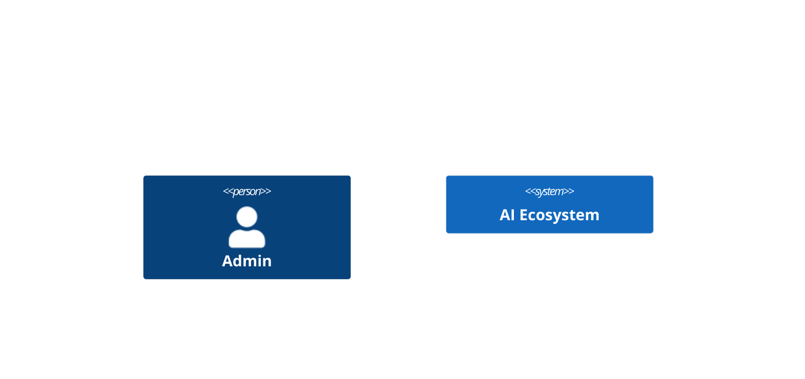

# C4 Model Diagrams

This file contains C4 Model diagrams using Mermaid or PlantUML syntax for version-controlled, machine-readable architecture.

## Example (Mermaid)

```mermaid
C4Context
    Person(admin, "Admin")
    System(system, "AI Ecosystem")
```
